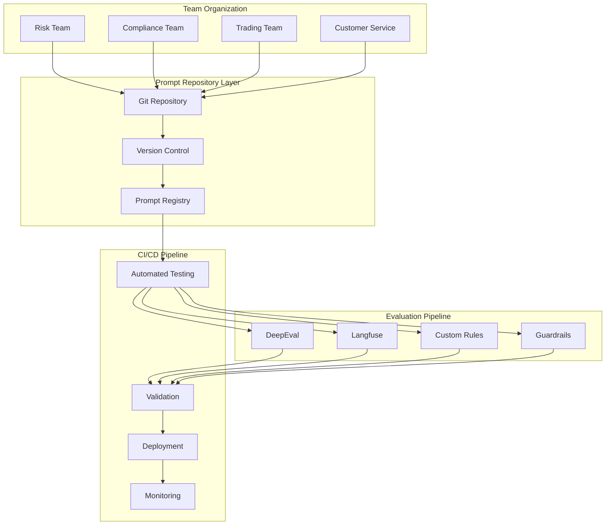

# PromptForge Enterprise Architecture
## Multi-Prompt Management System for Autonomous Teams

### Version 3.0 - Enterprise Grade

---

## 🏗️ Architecture Overview



## 📁 Enterprise Directory Structure

```
promptforge/
├── .github/
│   └── workflows/
│       ├── prompt-validation.yml      # CI/CD for prompt changes
│       ├── team-approval.yml          # Team-specific approval workflows
│       └── production-release.yml     # Production deployment pipeline
│
├── prompts/                            # PROMPT REPOSITORY
│   ├── _registry/
│   │   ├── index.json                 # Central prompt registry
│   │   ├── teams.json                 # Team ownership mapping
│   │   └── dependencies.json          # Cross-prompt dependencies
│   │
│   ├── _templates/                    # Reusable prompt templates
│   │   ├── base/
│   │   │   ├── chain_of_thought.jinja2
│   │   │   ├── few_shot.jinja2
│   │   └── financial/
│   │       ├── risk_assessment.jinja2
│   │       └── compliance_check.jinja2
│   │
│   ├── risk/                          # RISK TEAM PROMPTS
│   │   ├── portfolio_analysis/
│   │   │   ├── prompt.yaml           # Prompt definition
│   │   │   ├── versions/
│   │   │   │   ├── v1.0.0/
│   │   │   │   └── v2.0.0/
│   │   │   ├── tests/
│   │   │   │   ├── unit/
│   │   │   │   └── integration/
│   │   │   ├── evaluations/
│   │   │   │   ├── deepeval.yaml
│   │   │   │   └── custom_rules.py
│   │   │   └── README.md
│   │   └── credit_scoring/
│   │
│   ├── compliance/                    # COMPLIANCE TEAM PROMPTS
│   │   ├── kyc_verification/
│   │   ├── aml_screening/
│   │   └── regulatory_reporting/
│   │
│   ├── trading/                       # TRADING TEAM PROMPTS
│   │   ├── market_analysis/
│   │   ├── order_execution/
│   │   └── sentiment_analysis/
│   │
│   └── customer_service/              # CUSTOMER SERVICE PROMPTS
│       ├── account_inquiry/
│       ├── dispute_resolution/
│       └── product_recommendation/
│
├── evaluation/                         # EVALUATION LAYER
│   ├── core/
│   │   ├── base_evaluator.py
│   │   ├── deepeval_integration.py
│   │   ├── langfuse_integration.py
│   │   └── guardrails_integration.py
│   │
│   ├── financial/                     # FINANCIAL SERVICES RULES
│   │   ├── bias_detection.py
│   │   ├── compliance_rules.py
│   │   ├── risk_disclosure.py
│   │   └── regulatory_checks.py
│   │
│   ├── metrics/
│   │   ├── hallucination.py
│   │   ├── faithfulness.py
│   │   ├── toxicity.py
│   │   └── custom_metrics.py
│   │
│   └── reports/
│       ├── team_dashboard.py
│       └── executive_summary.py
│
├── infrastructure/                    # INFRASTRUCTURE AS CODE
│   ├── terraform/
│   │   ├── environments/
│   │   │   ├── dev/
│   │   │   ├── staging/
│   │   │   └── production/
│   │   └── modules/
│   │       ├── prompt_storage/
│   │       └── evaluation_pipeline/
│   │
│   └── kubernetes/
│       ├── deployments/
│       └── services/
│
├── sdk/                               # DEVELOPER SDK
│   ├── python/
│   │   ├── promptforge/
│   │   │   ├── client.py
│   │   │   ├── prompt.py
│   │   │   ├── evaluation.py
│   │   │   └── team.py
│   │   └── examples/
│   │
│   └── typescript/
│       └── src/
│
├── tools/                             # CLI TOOLS
│   ├── cli/
│   │   ├── promptforge.py
│   │   └── commands/
│   │       ├── create.py
│   │       ├── test.py
│   │       ├── deploy.py
│   │       └── rollback.py
│   │
│   └── scripts/
│       ├── migrate_prompts.py
│       └── generate_reports.py
│
└── docs/                              # DOCUMENTATION
    ├── getting-started/
    │   ├── quickstart.md
    │   ├── team-onboarding.md
    │   └── first-prompt.md
    │
    ├── guides/
    │   ├── prompt-lifecycle.md
    │   ├── evaluation-setup.md
    │   ├── ci-cd-pipeline.md
    │   └── team-workflows.md
    │
    └── api/
        └── reference.md
```

## 🔄 Prompt Lifecycle Management

### 1. Development Phase
```yaml
# prompts/risk/portfolio_analysis/prompt.yaml
metadata:
  name: portfolio_risk_analysis
  team: risk
  owner: risk-analytics@company.com
  version: 2.1.0
  status: development
  tags:
    - financial
    - risk-assessment
    - var-calculation

prompt:
  template: |
    Analyze the following portfolio for risk metrics:
    {portfolio_data}
    
    Calculate and provide:
    1. Value at Risk (VaR) at 95% confidence
    2. Expected Shortfall (ES)
    3. Sharpe Ratio
    4. Maximum Drawdown
    
    Use Chain-of-Thought reasoning for calculations.
  
  variables:
    portfolio_data:
      type: object
      required: true
      schema: portfolio_schema.json
  
  parameters:
    temperature: 0.1
    max_tokens: 2000
    model: gpt-4-turbo

evaluation:
  metrics:
    - hallucination: 0.95
    - accuracy: 0.98
    - compliance: true
  
  test_suite: tests/
  custom_rules: evaluations/risk_rules.py
```

### 2. Testing Phase
```python
# prompts/risk/portfolio_analysis/tests/unit/test_risk_calculations.py
import pytest
from promptforge import PromptTester
from evaluation.financial import RiskMetricsValidator

class TestPortfolioRiskAnalysis:
    def test_var_calculation_accuracy(self):
        """Test Value at Risk calculation accuracy"""
        tester = PromptTester("risk/portfolio_analysis")
        
        test_portfolio = {
            "positions": [...],
            "historical_data": [...]
        }
        
        result = tester.run(portfolio_data=test_portfolio)
        validator = RiskMetricsValidator()
        
        assert validator.validate_var(result.var_95) > 0.95
        assert result.has_chain_of_thought_reasoning()
    
    def test_compliance_requirements(self):
        """Ensure all regulatory disclosures are present"""
        # Test implementation
        pass
```

### 3. Evaluation Pipeline
```python
# evaluation/financial/compliance_rules.py
from typing import Dict, List, Tuple
from deepeval.metrics import BaseMetric

class FinancialComplianceMetric(BaseMetric):
    """Custom metric for financial services compliance"""
    
    def __init__(self):
        self.required_disclosures = [
            "past_performance_disclaimer",
            "risk_warning",
            "regulatory_notice",
            "conflict_of_interest"
        ]
    
    def evaluate(self, prompt_output: str) -> Dict[str, float]:
        """Evaluate compliance with financial regulations"""
        scores = {}
        
        # Check for required disclosures
        disclosure_score = self._check_disclosures(prompt_output)
        scores['disclosure_compliance'] = disclosure_score
        
        # Check for prohibited content
        prohibition_score = self._check_prohibitions(prompt_output)
        scores['prohibition_compliance'] = prohibition_score
        
        # Check for bias
        bias_score = self._check_bias(prompt_output)
        scores['bias_score'] = bias_score
        
        # Overall compliance score
        scores['overall'] = min(
            disclosure_score,
            prohibition_score,
            bias_score
        )
        
        return scores
    
    def _check_disclosures(self, text: str) -> float:
        """Check for required regulatory disclosures"""
        found = 0
        for disclosure in self.required_disclosures:
            if self._contains_disclosure(text, disclosure):
                found += 1
        return found / len(self.required_disclosures)
    
    def _check_prohibitions(self, text: str) -> float:
        """Check for prohibited content"""
        prohibited_terms = [
            "guaranteed returns",
            "risk-free",
            "insider information"
        ]
        
        for term in prohibited_terms:
            if term.lower() in text.lower():
                return 0.0
        return 1.0
    
    def _check_bias(self, text: str) -> float:
        """Check for demographic or investment bias"""
        # Implementation for bias detection
        return 0.95
```

## 🚀 CI/CD Pipeline

### GitHub Actions Workflow
```yaml
# .github/workflows/prompt-validation.yml
name: Prompt Validation Pipeline

on:
  pull_request:
    paths:
      - 'prompts/**'
      - 'evaluation/**'

jobs:
  validate-prompt:
    runs-on: ubuntu-latest
    
    steps:
      - uses: actions/checkout@v3
      
      - name: Setup Python
        uses: actions/setup-python@v4
        with:
          python-version: '3.11'
      
      - name: Install PromptForge
        run: |
          pip install -e .
          pip install -r requirements.txt
      
      - name: Identify Changed Prompts
        id: changes
        run: |
          echo "prompts=$(git diff --name-only origin/main...HEAD | grep '^prompts/' | grep -v '^prompts/_' | cut -d'/' -f2,3 | uniq)" >> $GITHUB_OUTPUT
      
      - name: Run Prompt Tests
        run: |
          for prompt in ${{ steps.changes.outputs.prompts }}; do
            promptforge test --prompt $prompt --verbose
          done
      
      - name: Run Evaluation Suite
        run: |
          for prompt in ${{ steps.changes.outputs.prompts }}; do
            promptforge evaluate \
              --prompt $prompt \
              --metrics hallucination,compliance,bias \
              --threshold 0.95
          done
      
      - name: Generate Report
        run: |
          promptforge report \
            --format html \
            --output evaluation-report.html
      
      - name: Upload Report
        uses: actions/upload-artifact@v3
        with:
          name: evaluation-report
          path: evaluation-report.html
      
      - name: Comment PR
        uses: actions/github-script@v6
        with:
          script: |
            const fs = require('fs');
            const report = fs.readFileSync('evaluation-summary.json');
            const data = JSON.parse(report);
            
            await github.rest.issues.createComment({
              owner: context.repo.owner,
              repo: context.repo.repo,
              issue_number: context.issue.number,
              body: `## Prompt Evaluation Results
              
              **Overall Score**: ${data.overall_score}/100
              
              ### Metrics
              - Hallucination: ${data.hallucination}
              - Compliance: ${data.compliance}
              - Bias: ${data.bias}
              
              [View Full Report](${data.report_url})`
            });

  security-scan:
    runs-on: ubuntu-latest
    steps:
      - name: Check for PII/Secrets
        run: |
          promptforge security-scan --path prompts/
      
      - name: Validate Guardrails
        run: |
          promptforge guardrails --validate
```

## 🛠️ CLI Tool Usage

### Creating a New Prompt
```bash
# Initialize new prompt with team template
promptforge create prompt \
  --team risk \
  --name credit_risk_assessment \
  --template financial/risk_assessment

# This creates:
# prompts/risk/credit_risk_assessment/
#   ├── prompt.yaml
#   ├── tests/
#   ├── evaluations/
#   └── README.md
```

### Testing and Evaluation
```bash
# Run tests for a specific prompt
promptforge test --prompt risk/credit_risk_assessment

# Run evaluation with custom metrics
promptforge evaluate \
  --prompt risk/credit_risk_assessment \
  --metrics hallucination,compliance,bias \
  --test-data datasets/credit_applications.json

# Compare prompt versions
promptforge compare \
  --prompt risk/credit_risk_assessment \
  --versions v1.0.0,v2.0.0
```

### Deployment
```bash
# Deploy to staging
promptforge deploy \
  --prompt risk/credit_risk_assessment \
  --version v2.0.0 \
  --env staging

# Promote to production with approval
promptforge promote \
  --prompt risk/credit_risk_assessment \
  --from staging \
  --to production \
  --require-approval

# Rollback if needed
promptforge rollback \
  --prompt risk/credit_risk_assessment \
  --env production
```

## 👥 Team Workflows

### Team Configuration
```yaml
# prompts/_registry/teams.yaml
teams:
  risk:
    name: Risk Analytics Team
    lead: john.smith@company.com
    members:
      - alice@company.com
      - bob@company.com
    permissions:
      - create_prompt
      - deploy_staging
    approval_required:
      - deploy_production
    
  compliance:
    name: Compliance Team
    lead: sarah.jones@company.com
    members:
      - mike@company.com
      - lisa@company.com
    permissions:
      - create_prompt
      - review_all_prompts
      - deploy_production
```

### Team-Specific Evaluation Rules
```python
# evaluation/teams/risk_team_rules.py
class RiskTeamEvaluator:
    """Custom evaluation rules for Risk Team prompts"""
    
    def __init__(self):
        self.min_scores = {
            "hallucination": 0.98,  # Stricter for risk
            "accuracy": 0.99,
            "compliance": 1.0
        }
    
    def evaluate(self, prompt_name: str, results: Dict):
        """Apply team-specific validation"""
        for metric, min_score in self.min_scores.items():
            if results.get(metric, 0) < min_score:
                raise ValidationError(
                    f"Risk team prompt {prompt_name} failed "
                    f"{metric}: {results[metric]} < {min_score}"
                )
```

## 📊 Monitoring & Observability

### Langfuse Integration
```python
# evaluation/core/langfuse_integration.py
from langfuse import Langfuse, observe
from typing import Dict, Any

class PromptObserver:
    """Enterprise prompt monitoring with Langfuse"""
    
    def __init__(self):
        self.client = Langfuse()
    
    @observe(name="prompt_execution")
    def track_prompt_execution(
        self,
        prompt_name: str,
        team: str,
        version: str,
        input_data: Dict[str, Any],
        output: str,
        metrics: Dict[str, float]
    ):
        """Track prompt execution with full observability"""
        
        # Log to Langfuse
        generation = self.client.generation(
            name=f"{team}/{prompt_name}",
            model_parameters={
                "version": version,
                "team": team
            },
            input=input_data,
            output=output,
            metadata=metrics
        )
        
        # Score based on evaluation
        for metric_name, score in metrics.items():
            generation.score(
                name=metric_name,
                value=score
            )
        
        return generation.id
```

## 🔐 Security & Governance

### Access Control
```yaml
# infrastructure/kubernetes/rbac.yaml
apiVersion: rbac.authorization.k8s.io/v1
kind: Role
metadata:
  name: prompt-developer
rules:
  - apiGroups: [""]
    resources: ["prompts"]
    verbs: ["get", "list", "create", "update"]
  - apiGroups: [""]
    resources: ["prompts/versions"]
    verbs: ["get", "list", "create"]
---
apiVersion: rbac.authorization.k8s.io/v1
kind: Role
metadata:
  name: prompt-approver
rules:
  - apiGroups: [""]
    resources: ["prompts/deployments"]
    verbs: ["approve", "reject"]
```

### Audit Logging
```python
# evaluation/core/audit.py
class PromptAuditLogger:
    """Comprehensive audit logging for compliance"""
    
    def log_prompt_change(
        self,
        prompt_name: str,
        user: str,
        action: str,
        details: Dict
    ):
        """Log all prompt modifications for audit trail"""
        audit_entry = {
            "timestamp": datetime.utcnow().isoformat(),
            "prompt": prompt_name,
            "user": user,
            "action": action,
            "details": details,
            "ip_address": self.get_client_ip(),
            "session_id": self.get_session_id()
        }
        
        # Store in audit database
        self.audit_db.insert(audit_entry)
        
        # Send to SIEM if configured
        if self.siem_enabled:
            self.siem_client.send(audit_entry)
```

## 🚦 Production Readiness Checklist

### Before Deployment
- [ ] All tests passing (unit, integration, e2e)
- [ ] Evaluation metrics meet thresholds
- [ ] Security scan completed
- [ ] Compliance review approved
- [ ] Performance benchmarks met
- [ ] Documentation updated
- [ ] Team lead approval
- [ ] Change management ticket created

### Monitoring Setup
- [ ] Langfuse tracking configured
- [ ] Alert thresholds defined
- [ ] Dashboard created
- [ ] Runbook documented
- [ ] Rollback plan tested

## 📈 Metrics & KPIs

### Team Performance Metrics
- Prompt deployment frequency
- Evaluation pass rate
- Average optimization cycles
- Time to production
- Rollback frequency

### Quality Metrics
- Average hallucination score
- Compliance violation rate
- Bias detection rate
- Customer satisfaction score
- Error rate in production

## 🔗 Integration Points

### External Systems
- **Git**: Version control and collaboration
- **JIRA**: Change management and approvals
- **Slack**: Notifications and alerts
- **DataDog**: Application monitoring
- **Snowflake**: Analytics and reporting
- **ServiceNow**: Incident management

---

**Next Steps**: See [IMPLEMENTATION_GUIDE.md](docs/IMPLEMENTATION_GUIDE.md) for detailed setup instructions.