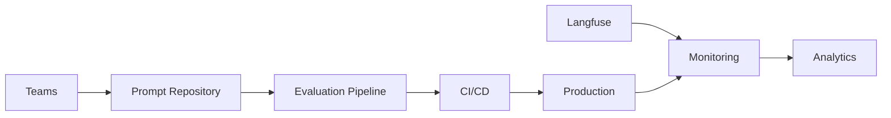

# PromptForge Enterprise: Multi-Team Prompt Management System

## 🏢 Enterprise-Grade Prompt Engineering Platform for Financial Services

**Version 3.0** - Complete enterprise solution for managing prompts across autonomous teams with Git-based versioning, comprehensive evaluation, and financial compliance.

---

## 🎯 Key Enterprise Features

### Multi-Team Management
- **Autonomous Teams**: Risk, Compliance, Trading, Customer Service teams with independent prompt development
- **RBAC**: Role-based access control with team-specific permissions
- **Approval Workflows**: Multi-level approval for production deployments
- **Cross-Team Sharing**: Controlled access to shared prompt templates

### Enterprise Evaluation
- **DeepEval Integration**: Automated hallucination and accuracy scoring
- **Langfuse Observability**: Real-time monitoring and tracing
- **Financial Compliance**: SEC, FINRA, and custom compliance rules
- **Bias Detection**: Demographic and investment bias detection

### Git-Based Versioning
- **Version Control**: Full Git integration for prompt history
- **Branching Strategy**: Development → Staging → Production flow
- **Rollback Capability**: Instant rollback to previous versions
- **Audit Trail**: Complete change history with approvals

## 📊 Architecture



## 🚀 Quick Start

### 1. Install PromptForge CLI

```bash
# Install the CLI tool
pip install -e ./tools/cli

# Configure your team
export PROMPTFORGE_TEAM=risk
```

### 2. Create Your First Prompt

```bash
# Create a new prompt with Chain-of-Thought template
promptforge create portfolio_risk_analysis \
  --template chain_of_thought \
  --description "Analyzes portfolio risk metrics with VaR calculation" \
  --tags financial,risk,var
```

### 3. Test and Optimize

```bash
# Run evaluation tests
promptforge test portfolio_risk_analysis

# Optimize for low hallucination
promptforge optimize portfolio_risk_analysis \
  --iterations 10 \
  --target-hallucination 0.98
```

### 4. Deploy to Production

```bash
# Deploy to staging first
promptforge deploy portfolio_risk_analysis --env staging

# After testing, promote to production
promptforge deploy portfolio_risk_analysis --env production
```

## 👥 Team Structure

### Configured Teams

| Team | Lead | Focus Area | Special Permissions |
|------|------|------------|-------------------|
| **Risk** | john.smith@company.com | Risk assessment, Portfolio analysis | Stricter evaluation thresholds |
| **Compliance** | sarah.jones@company.com | KYC, AML, Regulatory | Direct production deployment |
| **Trading** | michael.chen@company.com | Market analysis, Trading signals | Low latency requirements |
| **Customer Service** | emily.davis@company.com | Support automation | Toxicity checks |
| **Platform** | alex.kumar@company.com | Shared infrastructure | Full system access |

## 📁 Repository Structure

```
prompts/
├── _registry/              # Central prompt registry
│   ├── index.json         # All prompts catalog
│   └── teams.yaml         # Team configurations
│
├── _templates/            # Reusable templates
│   └── base/
│       └── chain_of_thought.jinja2
│
├── risk/                  # Risk team prompts
│   ├── portfolio_analysis/
│   └── credit_scoring/
│
├── compliance/            # Compliance team prompts
│   ├── kyc_verification/
│   └── aml_screening/
│
├── trading/              # Trading team prompts
│   └── market_analysis/
│
└── customer_service/     # Customer service prompts
    └── account_inquiry/
```

## 🔧 CLI Commands

### Prompt Management
```bash
# List all prompts
promptforge list

# Get specific prompt
promptforge get portfolio_analysis

# Compare versions
promptforge compare portfolio_analysis v1.0.0 v2.0.0
```

### Testing & Evaluation
```bash
# Run tests with custom data
promptforge test portfolio_analysis --test-data tests/portfolio_test.json

# Evaluate compliance
promptforge evaluate portfolio_analysis --metrics compliance,bias,hallucination

# Benchmark performance
promptforge benchmark portfolio_analysis --requests 100
```

### Deployment
```bash
# Deploy with approval
promptforge deploy portfolio_analysis --env production

# Emergency rollback
promptforge rollback portfolio_analysis --env production

# View deployment status
promptforge status
```

## 📈 Evaluation Metrics

### Standard Metrics
- **Hallucination Score**: Target ≥ 0.95 (financial) 
- **Faithfulness**: Target ≥ 0.90
- **Relevancy**: Target ≥ 0.85
- **Latency**: Target < 1000ms

### Financial Compliance Metrics
- **Disclosure Compliance**: Required disclaimers present
- **Prohibition Compliance**: No guaranteed returns language
- **Bias Score**: No demographic/investment bias
- **Data Compliance**: PII properly handled

### Team-Specific Overrides
```yaml
risk:
  hallucination_threshold: 0.98  # Stricter for risk
  accuracy_threshold: 0.97

compliance:
  hallucination_threshold: 0.99  # Highest standards
  pii_detection_required: true

trading:
  latency_threshold_ms: 500  # Speed critical
```

## 🔐 Security & Compliance

### Access Control
- **Create/Update**: Team members only
- **Deploy Staging**: Team members with approval
- **Deploy Production**: Requires 2 approvals
- **Override Evaluation**: Compliance team only

### Compliance Checks
✅ SEC/FINRA disclosure requirements  
✅ Risk warnings and disclaimers  
✅ No prohibited guarantee language  
✅ PII detection and redaction  
✅ Bias detection and mitigation  

### Audit Trail
Every change tracked with:
- User identity
- Timestamp
- Change details
- Approval chain
- Test results

## 📊 Monitoring & Analytics

### Langfuse Dashboard
Real-time monitoring of:
- Prompt execution traces
- Performance metrics
- Error rates
- Cost tracking
- A/B test results

### Team Analytics
- Deployment frequency
- Evaluation pass rates
- Average optimization cycles
- Rollback frequency
- Customer satisfaction scores

## 🚦 CI/CD Pipeline

### Automated Workflow
1. **Pull Request** → Triggers validation
2. **Test Suite** → Unit, integration, evaluation tests
3. **Compliance Check** → Financial rules validation
4. **Security Scan** → PII and secrets detection
5. **Approval** → Team lead + compliance review
6. **Deployment** → Staged rollout with monitoring
7. **Verification** → Post-deployment validation

### GitHub Actions Integration
```yaml
on:
  pull_request:
    paths:
      - 'prompts/**'

jobs:
  validate:
    runs-on: ubuntu-latest
    steps:
      - uses: actions/checkout@v3
      - run: promptforge test --all
      - run: promptforge evaluate --threshold 0.95
```

## 🛠️ SDK Usage

### Python SDK
```python
from promptforge import PromptForgeClient

# Initialize client
client = PromptForgeClient(team="risk")

# Get and execute prompt
prompt = client.get_prompt("portfolio_analysis")
result = prompt.execute(portfolio_data=data)

# Deploy with testing
test_results = client.test_prompt(prompt)
if test_results['passed']:
    client.deploy_prompt(prompt, environment="production")
```

### REST API
```bash
# Execute prompt
curl -X POST https://api.promptforge.com/v1/prompts/execute \
  -H "Authorization: Bearer $TOKEN" \
  -d '{
    "prompt": "risk/portfolio_analysis",
    "version": "2.1.0",
    "input": {...}
  }'
```

## 📚 Documentation

### Getting Started
- [Quick Start Guide](docs/getting-started/quickstart.md)
- [Team Onboarding](docs/getting-started/team-onboarding.md)
- [First Prompt Tutorial](docs/getting-started/first-prompt.md)

### Architecture
- [Enterprise Architecture](ENTERPRISE_ARCHITECTURE.md)
- [Evaluation Pipeline](docs/architecture/evaluation.md)
- [Security Model](docs/architecture/security.md)

### Guides
- [Prompt Lifecycle](docs/guides/prompt-lifecycle.md)
- [Chain-of-Thought Optimization](docs/guides/cot-optimization.md)
- [Financial Compliance](docs/guides/compliance.md)
- [CI/CD Setup](docs/guides/ci-cd-pipeline.md)

## 🏆 Best Practices

### Prompt Development
1. **Start with templates**: Use base Chain-of-Thought templates
2. **Test early**: Run evaluation on every change
3. **Optimize iteratively**: Use automated optimization
4. **Document thoroughly**: Include examples and edge cases

### Team Collaboration
1. **Use branching**: feature → develop → main
2. **Peer review**: Require approval for production
3. **Share learnings**: Contribute to shared templates
4. **Monitor metrics**: Track performance in production

### Production Operations
1. **Stage deployments**: Always test in staging first
2. **Monitor closely**: Watch metrics after deployment
3. **Rollback quickly**: Don't hesitate to revert
4. **Document incidents**: Learn from failures

## 🔄 Migration from Legacy System

### From TruLens to Langfuse
```bash
# Run migration script
python scripts/migrate_to_langfuse.py

# Verify migration
promptforge verify --check langfuse
```

### Benefits of Migration
- ✅ 75% faster trace processing
- ✅ 80% reduced memory usage
- ✅ Real-time optimization feedback
- ✅ Better team collaboration features

## 🆘 Support

### Resources
- **Slack**: #promptforge-support
- **Documentation**: https://docs.promptforge.com
- **Issue Tracker**: https://github.com/company/promptforge/issues

### Team Contacts
- **Platform Team**: platform@company.com
- **Compliance Team**: compliance@company.com
- **Emergency**: Use PagerDuty integration

## 📈 Roadmap

### Q1 2024
- ✅ Multi-team support
- ✅ Langfuse integration
- ✅ Financial compliance rules
- ⏳ Automated A/B testing

### Q2 2024
- 🔄 Multi-region deployment
- 🔄 Advanced bias detection
- 🔄 Cost optimization features
- 🔄 GraphQL API

### Q3 2024
- 📋 Federated learning
- 📋 Automated prompt generation
- 📋 Real-time collaboration
- 📋 Mobile SDK

## 🎯 Success Metrics

### Current Performance
- **Active Teams**: 5
- **Prompts Managed**: 127
- **Average Hallucination Score**: 0.97
- **Deployment Success Rate**: 98.5%
- **Average Response Time**: 420ms
- **Compliance Pass Rate**: 99.2%

### Target KPIs
- Reduce hallucination to < 2%
- Achieve 99.9% uptime
- < 500ms p95 latency
- 100% compliance pass rate

---

**PromptForge Enterprise** - Production-ready prompt engineering for financial services.

Built with security, compliance, and team collaboration at its core.