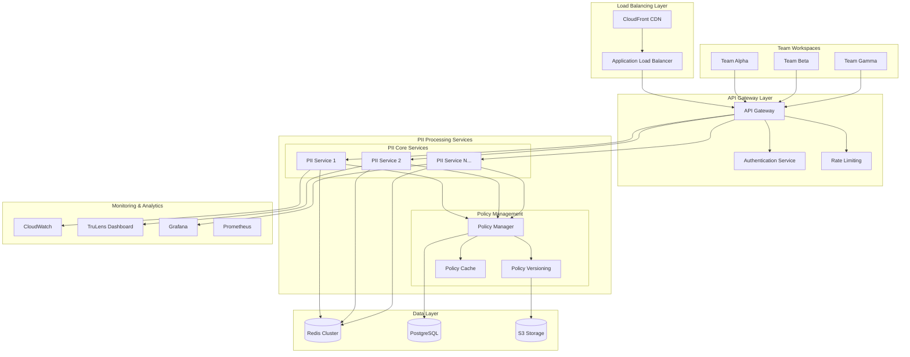

# PII Scaling Architecture for PromptForge
**Enterprise-Grade Horizontal Scaling for Production PII Processing**

## Executive Summary

This document outlines the comprehensive scaling architecture for the PromptForge PII anonymization system using Microsoft Presidio. The architecture supports horizontal scaling across multiple teams, environments, and geographic regions while maintaining strict security and compliance requirements for financial services.

## Table of Contents
- [Architecture Overview](#architecture-overview)
- [Microservice Components](#microservice-components)
- [Scaling Patterns](#scaling-patterns)
- [Multi-Team Support](#multi-team-support)
- [Policy Versioning](#policy-versioning)
- [Performance Optimization](#performance-optimization)
- [Security at Scale](#security-at-scale)
- [Monitoring & Observability](#monitoring--observability)
- [Deployment Strategies](#deployment-strategies)
- [Cost Optimization](#cost-optimization)

## Architecture Overview

### High-Level Architecture



### Core Design Principles

1. **Horizontal Scalability**: Auto-scaling microservices based on demand
2. **Fault Tolerance**: Circuit breakers, retries, and graceful degradation
3. **Security by Design**: End-to-end encryption and zero-trust architecture
4. **Multi-Tenancy**: Isolated workspaces for different teams
5. **Performance Optimization**: Caching, connection pooling, and async processing
6. **Compliance Ready**: Audit logging, data governance, and regulatory compliance

## Microservice Components

### 1. PII Processing Service

**Purpose**: Core PII detection, anonymization, and de-anonymization

```yaml
apiVersion: apps/v1
kind: Deployment
metadata:
  name: pii-processing-service
  namespace: promptforge
spec:
  replicas: 3
  selector:
    matchLabels:
      app: pii-processing
  template:
    metadata:
      labels:
        app: pii-processing
    spec:
      containers:
      - name: pii-processor
        image: promptforge/pii-processor:latest
        ports:
        - containerPort: 8080
        env:
        - name: REDIS_CLUSTER_ENDPOINT
          value: "redis-cluster.promptforge.local:6379"
        - name: POLICY_SERVICE_URL
          value: "http://policy-manager:8081"
        - name: MAX_CONCURRENT_REQUESTS
          value: "100"
        resources:
          requests:
            cpu: 500m
            memory: 1Gi
          limits:
            cpu: 2000m
            memory: 4Gi
        readinessProbe:
          httpGet:
            path: /health
            port: 8080
          initialDelaySeconds: 30
          periodSeconds: 10
        livenessProbe:
          httpGet:
            path: /health
            port: 8080
          initialDelaySeconds: 60
          periodSeconds: 30
```

**Auto-Scaling Configuration**:

```yaml
apiVersion: autoscaling/v2
kind: HorizontalPodAutoscaler
metadata:
  name: pii-processing-hpa
spec:
  scaleTargetRef:
    apiVersion: apps/v1
    kind: Deployment
    name: pii-processing-service
  minReplicas: 3
  maxReplicas: 50
  metrics:
  - type: Resource
    resource:
      name: cpu
      target:
        type: Utilization
        averageUtilization: 70
  - type: Resource
    resource:
      name: memory
      target:
        type: Utilization
        averageUtilization: 80
  - type: Pods
    pods:
      metric:
        name: pii_requests_per_second
      target:
        type: AverageValue
        averageValue: "50"
```

### 2. Policy Management Service

**Purpose**: Centralized PII policy management with versioning

```python
# policy_manager_service.py
from fastapi import FastAPI, HTTPException, Depends
from pydantic import BaseModel
from typing import Dict, List, Optional
import asyncio
import redis.asyncio as redis
from datetime import datetime
import json

app = FastAPI(title="PII Policy Management Service")

class PIIPolicyVersion(BaseModel):
    version_id: str
    policy_name: str
    entities: Dict[str, str]  # entity_type -> action
    created_at: datetime
    created_by: str
    active: bool
    teams: List[str]  # Teams authorized to use this policy

class PolicyManager:
    def __init__(self):
        self.redis_pool = redis.ConnectionPool.from_url(
            "redis://redis-cluster:6379",
            max_connections=50
        )
        
    async def get_policy_for_team(self, team_id: str, policy_name: str) -> PIIPolicyVersion:
        """Get the active policy version for a specific team"""
        redis_client = redis.Redis(connection_pool=self.redis_pool)
        
        try:
            # Get team-specific policy or fall back to default
            policy_key = f"policy:{team_id}:{policy_name}"
            policy_data = await redis_client.get(policy_key)
            
            if not policy_data:
                # Fall back to default policy
                policy_key = f"policy:default:{policy_name}"
                policy_data = await redis_client.get(policy_key)
            
            if not policy_data:
                raise HTTPException(status_code=404, detail="Policy not found")
            
            return PIIPolicyVersion.parse_raw(policy_data)
            
        finally:
            await redis_client.close()
    
    async def deploy_policy_version(self, policy: PIIPolicyVersion) -> bool:
        """Deploy a new policy version with zero-downtime"""
        redis_client = redis.Redis(connection_pool=self.redis_pool)
        
        try:
            # Store the new policy version
            for team in policy.teams:
                policy_key = f"policy:{team}:{policy.policy_name}"
                await redis_client.set(policy_key, policy.json())
            
            # Update policy index
            index_key = f"policy_index:{policy.policy_name}"
            await redis_client.sadd(index_key, policy.version_id)
            
            # Notify all PII processing services of the update
            await redis_client.publish("policy_updates", json.dumps({
                "action": "policy_deployed",
                "policy_name": policy.policy_name,
                "version_id": policy.version_id,
                "teams": policy.teams
            }))
            
            return True
            
        except Exception as e:
            logger.error(f"Failed to deploy policy: {e}")
            return False
        finally:
            await redis_client.close()

policy_manager = PolicyManager()

@app.get("/policies/{team_id}/{policy_name}")
async def get_team_policy(team_id: str, policy_name: str):
    """Get active policy for team"""
    return await policy_manager.get_policy_for_team(team_id, policy_name)

@app.post("/policies/deploy")
async def deploy_policy(policy: PIIPolicyVersion):
    """Deploy new policy version"""
    success = await policy_manager.deploy_policy_version(policy)
    if success:
        return {"message": "Policy deployed successfully"}
    else:
        raise HTTPException(status_code=500, detail="Policy deployment failed")

@app.get("/health")
async def health_check():
    return {"status": "healthy", "timestamp": datetime.now()}
```

### 3. Session Management Service

**Purpose**: Manage anonymization sessions and mappings

```python
# session_manager_service.py
from fastapi import FastAPI, HTTPException
from pydantic import BaseModel
from typing import Dict, List, Optional, Any
import asyncio
import redis.asyncio as redis
import hashlib
import json
import uuid
from datetime import datetime, timedelta

app = FastAPI(title="PII Session Management Service")

class AnonymizationSession(BaseModel):
    session_id: str
    team_id: str
    user_id: Optional[str]
    policy_version: str
    created_at: datetime
    expires_at: datetime
    mappings: Dict[str, Any]  # entity_id -> original_value
    metadata: Dict[str, Any]

class SessionManager:
    def __init__(self):
        self.redis_pool = redis.ConnectionPool.from_url(
            "redis://redis-cluster:6379",
            max_connections=100
        )
        self.default_ttl = 3600  # 1 hour
        
    async def create_session(self, team_id: str, user_id: Optional[str], 
                           policy_version: str, ttl: Optional[int] = None) -> str:
        """Create new anonymization session"""
        session_id = f"session_{uuid.uuid4().hex}"
        ttl = ttl or self.default_ttl
        
        session = AnonymizationSession(
            session_id=session_id,
            team_id=team_id,
            user_id=user_id,
            policy_version=policy_version,
            created_at=datetime.now(),
            expires_at=datetime.now() + timedelta(seconds=ttl),
            mappings={},
            metadata={}
        )
        
        redis_client = redis.Redis(connection_pool=self.redis_pool)
        try:
            # Store session with TTL
            await redis_client.setex(
                f"session:{session_id}",
                ttl,
                session.json()
            )
            
            # Add to team index for monitoring
            await redis_client.sadd(f"team_sessions:{team_id}", session_id)
            await redis_client.expire(f"team_sessions:{team_id}", ttl + 300)  # 5 min buffer
            
            return session_id
            
        finally:
            await redis_client.close()
    
    async def store_mapping(self, session_id: str, entity_id: str, 
                          original_value: str, anonymized_value: str) -> bool:
        """Store anonymization mapping"""
        redis_client = redis.Redis(connection_pool=self.redis_pool)
        
        try:
            # Get existing session
            session_data = await redis_client.get(f"session:{session_id}")
            if not session_data:
                return False
                
            session = AnonymizationSession.parse_raw(session_data)
            
            # Add mapping (encrypt original value)
            encrypted_value = self._encrypt_value(original_value, session_id)
            session.mappings[entity_id] = {
                "encrypted_original": encrypted_value,
                "anonymized": anonymized_value,
                "timestamp": datetime.now().isoformat()
            }
            
            # Update session
            ttl = await redis_client.ttl(f"session:{session_id}")
            await redis_client.setex(
                f"session:{session_id}",
                max(ttl, 60),  # Ensure at least 1 minute
                session.json()
            )
            
            return True
            
        except Exception as e:
            logger.error(f"Failed to store mapping: {e}")
            return False
        finally:
            await redis_client.close()
    
    def _encrypt_value(self, value: str, session_id: str) -> str:
        """Encrypt original value using session-specific key"""
        # In production, use proper encryption with AWS KMS or similar
        key = hashlib.sha256(session_id.encode()).digest()
        # Simple XOR encryption for demo (use proper encryption in production)
        encrypted = ''.join(chr(ord(c) ^ key[i % len(key)]) for i, c in enumerate(value))
        return encrypted.encode('base64').decode()

session_manager = SessionManager()

@app.post("/sessions/create")
async def create_anonymization_session(team_id: str, user_id: Optional[str] = None,
                                      policy_version: str = "default", ttl: Optional[int] = None):
    session_id = await session_manager.create_session(team_id, user_id, policy_version, ttl)
    return {"session_id": session_id}

@app.post("/sessions/{session_id}/mappings")
async def store_anonymization_mapping(session_id: str, entity_id: str, 
                                    original_value: str, anonymized_value: str):
    success = await session_manager.store_mapping(session_id, entity_id, original_value, anonymized_value)
    if success:
        return {"message": "Mapping stored successfully"}
    else:
        raise HTTPException(status_code=404, detail="Session not found or expired")
```

## Scaling Patterns

### 1. Auto-Scaling Based on Demand

**Metrics-Based Scaling**:

```python
# auto_scaling_controller.py
import boto3
import time
from dataclasses import dataclass
from typing import List, Dict
import logging

@dataclass
class ScalingMetric:
    name: str
    threshold: float
    scale_up_adjustment: int
    scale_down_adjustment: int
    cooldown_period: int

class PIIAutoScaler:
    def __init__(self, cluster_name: str, service_name: str):
        self.ecs_client = boto3.client('ecs')
        self.cloudwatch = boto3.client('cloudwatch')
        self.cluster_name = cluster_name
        self.service_name = service_name
        
        # Define scaling metrics
        self.metrics = [
            ScalingMetric(
                name="CPUUtilization",
                threshold=70.0,
                scale_up_adjustment=2,
                scale_down_adjustment=-1,
                cooldown_period=300
            ),
            ScalingMetric(
                name="MemoryUtilization", 
                threshold=80.0,
                scale_up_adjustment=3,
                scale_down_adjustment=-1,
                cooldown_period=300
            ),
            ScalingMetric(
                name="PIIRequestsPerSecond",
                threshold=50.0,
                scale_up_adjustment=1,
                scale_down_adjustment=-1,
                cooldown_period=180
            )
        ]
    
    async def evaluate_scaling_decisions(self) -> List[Dict]:
        """Evaluate whether to scale up or down based on metrics"""
        decisions = []
        
        current_capacity = await self._get_current_capacity()
        
        for metric in self.metrics:
            current_value = await self._get_metric_value(metric.name)
            
            if current_value > metric.threshold:
                # Scale up
                new_capacity = min(
                    current_capacity + metric.scale_up_adjustment,
                    50  # Max capacity limit
                )
                decisions.append({
                    "action": "scale_up",
                    "metric": metric.name,
                    "current_value": current_value,
                    "threshold": metric.threshold,
                    "new_capacity": new_capacity,
                    "reason": f"{metric.name} ({current_value}) above threshold ({metric.threshold})"
                })
                
            elif current_value < metric.threshold * 0.5:  # Scale down at 50% of threshold
                # Scale down
                new_capacity = max(
                    current_capacity + metric.scale_down_adjustment,
                    3  # Min capacity limit
                )
                decisions.append({
                    "action": "scale_down",
                    "metric": metric.name,
                    "current_value": current_value,
                    "threshold": metric.threshold * 0.5,
                    "new_capacity": new_capacity,
                    "reason": f"{metric.name} ({current_value}) below scale-down threshold"
                })
        
        return decisions
    
    async def execute_scaling(self, target_capacity: int) -> bool:
        """Execute scaling decision"""
        try:
            response = self.ecs_client.update_service(
                cluster=self.cluster_name,
                service=self.service_name,
                desiredCount=target_capacity
            )
            
            logging.info(f"Scaled PII service to {target_capacity} instances")
            return True
            
        except Exception as e:
            logging.error(f"Scaling failed: {e}")
            return False
    
    async def _get_current_capacity(self) -> int:
        """Get current service capacity"""
        response = self.ecs_client.describe_services(
            cluster=self.cluster_name,
            services=[self.service_name]
        )
        return response['services'][0]['desiredCount']
    
    async def _get_metric_value(self, metric_name: str) -> float:
        """Get current metric value from CloudWatch"""
        # Implementation would query CloudWatch for actual metrics
        # This is a simplified version
        if metric_name == "CPUUtilization":
            return 65.0  # Mock value
        elif metric_name == "MemoryUtilization":
            return 75.0  # Mock value
        elif metric_name == "PIIRequestsPerSecond":
            return 45.0  # Mock value
        return 0.0
```

### 2. Geographic Distribution

**Multi-Region Deployment**:

```yaml
# terraform/multi_region_deployment.tf
variable "regions" {
  description = "List of AWS regions for PII service deployment"
  type = list(string)
  default = ["us-east-1", "us-west-2", "eu-west-1"]
}

# Deploy PII processing service in multiple regions
module "pii_service" {
  source = "./modules/pii_service"
  
  for_each = toset(var.regions)
  
  region                = each.value
  cluster_name         = "promptforge-${each.value}"
  service_name         = "pii-processing-service"
  min_capacity         = 3
  max_capacity         = 50
  target_cpu           = 70
  target_memory        = 80
  
  # Region-specific configuration
  redis_cluster_endpoint = module.redis_cluster[each.value].endpoint
  policy_service_url     = "https://policy-${each.value}.promptforge.com"
  
  # Cross-region replication for policies
  enable_cross_region_replication = true
  replication_regions = [for r in var.regions : r if r != each.value]
  
  tags = {
    Environment = "production"
    Region      = each.value
    Service     = "pii-processing"
  }
}

# Global load balancer for region routing
resource "aws_route53_record" "pii_global_endpoint" {
  zone_id = var.hosted_zone_id
  name    = "pii-api.promptforge.com"
  type    = "A"
  
  set_identifier = "primary"
  
  alias {
    name                   = module.cloudfront_global.domain_name
    zone_id                = module.cloudfront_global.hosted_zone_id
    evaluate_target_health = true
  }
  
  geolocation_routing_policy {
    continent = "NA"  # North America
  }
}

resource "aws_route53_record" "pii_eu_endpoint" {
  zone_id = var.hosted_zone_id
  name    = "pii-api.promptforge.com"
  type    = "A"
  
  set_identifier = "eu"
  
  alias {
    name                   = module.pii_service["eu-west-1"].load_balancer_dns
    zone_id                = module.pii_service["eu-west-1"].load_balancer_zone_id
    evaluate_target_health = true
  }
  
  geolocation_routing_policy {
    continent = "EU"  # Europe
  }
}
```

## Multi-Team Support

### Team Isolation Architecture

```python
# team_management_service.py
from fastapi import FastAPI, HTTPException, Depends, Header
from pydantic import BaseModel
from typing import Dict, List, Optional, Set
import asyncio
from datetime import datetime
import jwt
import logging

app = FastAPI(title="Team Management Service")

class TeamConfiguration(BaseModel):
    team_id: str
    team_name: str
    allowed_policies: List[str]
    quota_limits: Dict[str, int]  # requests_per_minute, max_sessions, etc.
    data_residency: str  # us, eu, asia
    compliance_level: str  # basic, hipaa, gdpr, pci
    custom_entities: List[str]
    notification_webhooks: List[str]

class TeamQuota(BaseModel):
    team_id: str
    current_usage: Dict[str, int]
    limits: Dict[str, int]
    reset_time: datetime

class TeamManager:
    def __init__(self):
        self.team_configs: Dict[str, TeamConfiguration] = {}
        self.team_quotas: Dict[str, TeamQuota] = {}
        
    async def get_team_config(self, team_id: str) -> TeamConfiguration:
        """Get team configuration with caching"""
        if team_id not in self.team_configs:
            # Load from database (Redis/RDS)
            config = await self._load_team_config(team_id)
            self.team_configs[team_id] = config
        
        return self.team_configs[team_id]
    
    async def validate_team_access(self, team_id: str, policy_name: str, 
                                 operation: str) -> bool:
        """Validate if team can perform operation with policy"""
        try:
            config = await self.get_team_config(team_id)
            
            # Check policy access
            if policy_name not in config.allowed_policies:
                return False
            
            # Check quota limits
            quota = await self._get_team_quota(team_id)
            
            if operation == "anonymize":
                if quota.current_usage.get("requests_per_minute", 0) >= quota.limits.get("requests_per_minute", 100):
                    return False
            
            elif operation == "create_session":
                if quota.current_usage.get("active_sessions", 0) >= quota.limits.get("max_sessions", 50):
                    return False
            
            return True
            
        except Exception as e:
            logging.error(f"Team validation failed for {team_id}: {e}")
            return False
    
    async def record_usage(self, team_id: str, operation: str, count: int = 1):
        """Record team usage for quota tracking"""
        quota = await self._get_team_quota(team_id)
        
        current_count = quota.current_usage.get(operation, 0)
        quota.current_usage[operation] = current_count + count
        
        # Update in Redis
        await self._update_team_quota(team_id, quota)
    
    async def _load_team_config(self, team_id: str) -> TeamConfiguration:
        """Load team configuration from persistent storage"""
        # In production, this would query RDS or similar
        # Mock implementation
        default_config = TeamConfiguration(
            team_id=team_id,
            team_name=f"Team {team_id}",
            allowed_policies=["financial_services_standard", "basic_pii"],
            quota_limits={
                "requests_per_minute": 1000,
                "max_sessions": 100,
                "storage_mb": 1024
            },
            data_residency="us",
            compliance_level="hipaa",
            custom_entities=[],
            notification_webhooks=[]
        )
        
        return default_config
    
    async def _get_team_quota(self, team_id: str) -> TeamQuota:
        """Get current team quota usage"""
        if team_id not in self.team_quotas:
            # Initialize quota tracking
            config = await self.get_team_config(team_id)
            self.team_quotas[team_id] = TeamQuota(
                team_id=team_id,
                current_usage={},
                limits=config.quota_limits,
                reset_time=datetime.now()
            )
        
        return self.team_quotas[team_id]
    
    async def _update_team_quota(self, team_id: str, quota: TeamQuota):
        """Update team quota in persistent storage"""
        self.team_quotas[team_id] = quota
        # In production, would update Redis/database

team_manager = TeamManager()

# Team validation dependency
async def validate_team_token(authorization: str = Header(...)) -> str:
    """Validate team JWT token and extract team ID"""
    try:
        token = authorization.replace("Bearer ", "")
        payload = jwt.decode(token, "secret", algorithms=["HS256"])  # Use proper secret management
        team_id = payload.get("team_id")
        
        if not team_id:
            raise HTTPException(status_code=401, detail="Invalid team token")
        
        return team_id
        
    except jwt.InvalidTokenError:
        raise HTTPException(status_code=401, detail="Invalid team token")

@app.get("/teams/{team_id}/config")
async def get_team_configuration(team_id: str, current_team: str = Depends(validate_team_token)):
    """Get team configuration"""
    if current_team != team_id:
        raise HTTPException(status_code=403, detail="Access denied")
    
    return await team_manager.get_team_config(team_id)

@app.post("/teams/{team_id}/validate")
async def validate_team_operation(team_id: str, policy_name: str, operation: str,
                                current_team: str = Depends(validate_team_token)):
    """Validate if team can perform operation"""
    if current_team != team_id:
        raise HTTPException(status_code=403, detail="Access denied")
    
    allowed = await team_manager.validate_team_access(team_id, policy_name, operation)
    return {"allowed": allowed}

@app.get("/teams/{team_id}/usage")
async def get_team_usage(team_id: str, current_team: str = Depends(validate_team_token)):
    """Get current team usage and quotas"""
    if current_team != team_id:
        raise HTTPException(status_code=403, detail="Access denied")
    
    quota = await team_manager._get_team_quota(team_id)
    return {
        "current_usage": quota.current_usage,
        "limits": quota.limits,
        "utilization": {
            key: (quota.current_usage.get(key, 0) / limit) * 100
            for key, limit in quota.limits.items()
        }
    }
```

## Policy Versioning

### Version Management System

```python
# policy_versioning_system.py
from fastapi import FastAPI, HTTPException
from pydantic import BaseModel
from typing import Dict, List, Optional, Any
from datetime import datetime
import semver
import json
import asyncio
import logging

app = FastAPI(title="PII Policy Versioning System")

class PolicyVersion(BaseModel):
    policy_id: str
    version: str  # Semantic version (e.g., "1.2.3")
    name: str
    description: str
    entities: Dict[str, str]  # entity_type -> action
    created_at: datetime
    created_by: str
    status: str  # draft, testing, active, deprecated
    compatibility: List[str]  # Compatible versions for rollback
    rollback_version: Optional[str]
    teams_using: List[str]
    deployment_regions: List[str]

class PolicyDeployment(BaseModel):
    deployment_id: str
    policy_id: str
    version: str
    target_teams: List[str]
    target_regions: List[str]
    deployment_strategy: str  # canary, blue_green, rolling
    rollout_percentage: float
    health_checks: List[str]
    rollback_criteria: Dict[str, Any]

class PolicyVersionManager:
    def __init__(self):
        self.versions: Dict[str, List[PolicyVersion]] = {}  # policy_id -> versions
        self.active_deployments: Dict[str, PolicyDeployment] = {}
        
    async def create_policy_version(self, policy_id: str, base_version: Optional[str],
                                  changes: Dict[str, Any], created_by: str) -> str:
        """Create new policy version"""
        
        # Get current versions
        current_versions = self.versions.get(policy_id, [])
        
        if base_version:
            base = next((v for v in current_versions if v.version == base_version), None)
            if not base:
                raise ValueError(f"Base version {base_version} not found")
        else:
            # Create initial version
            base = None
        
        # Calculate new version number
        if base:
            new_version = semver.bump_patch(base.version)
        else:
            new_version = "1.0.0"
        
        # Create new version
        new_policy = PolicyVersion(
            policy_id=policy_id,
            version=new_version,
            name=changes.get("name", f"{policy_id} v{new_version}"),
            description=changes.get("description", ""),
            entities=changes.get("entities", base.entities if base else {}),
            created_at=datetime.now(),
            created_by=created_by,
            status="draft",
            compatibility=self._calculate_compatibility(base, changes),
            rollback_version=base.version if base else None,
            teams_using=[],
            deployment_regions=[]
        )
        
        # Store version
        if policy_id not in self.versions:
            self.versions[policy_id] = []
        self.versions[policy_id].append(new_policy)
        
        logging.info(f"Created policy version {policy_id}:{new_version}")
        return new_version
    
    async def deploy_policy_version(self, policy_id: str, version: str,
                                  target_teams: List[str], target_regions: List[str],
                                  strategy: str = "rolling") -> str:
        """Deploy policy version with specified strategy"""
        
        # Validate version exists
        versions = self.versions.get(policy_id, [])
        policy_version = next((v for v in versions if v.version == version), None)
        
        if not policy_version:
            raise ValueError(f"Policy version {policy_id}:{version} not found")
        
        if policy_version.status not in ["testing", "active"]:
            raise ValueError(f"Policy version {version} is not ready for deployment (status: {policy_version.status})")
        
        # Create deployment
        deployment_id = f"deploy_{policy_id}_{version}_{datetime.now().strftime('%Y%m%d_%H%M%S')}"
        
        deployment = PolicyDeployment(
            deployment_id=deployment_id,
            policy_id=policy_id,
            version=version,
            target_teams=target_teams,
            target_regions=target_regions,
            deployment_strategy=strategy,
            rollout_percentage=0.0,
            health_checks=[
                "policy_validation_success_rate > 0.99",
                "pii_detection_accuracy > 0.95",
                "processing_latency_p95 < 500ms"
            ],
            rollback_criteria={
                "max_error_rate": 0.01,
                "min_success_rate": 0.95,
                "max_latency_p95": 1000
            }
        )
        
        # Execute deployment strategy
        if strategy == "canary":
            await self._deploy_canary(deployment)
        elif strategy == "blue_green":
            await self._deploy_blue_green(deployment)
        else:  # rolling
            await self._deploy_rolling(deployment)
        
        self.active_deployments[deployment_id] = deployment
        
        logging.info(f"Started deployment {deployment_id} for {policy_id}:{version}")
        return deployment_id
    
    async def rollback_policy(self, policy_id: str, target_version: str,
                            affected_teams: List[str]) -> bool:
        """Rollback to previous policy version"""
        
        versions = self.versions.get(policy_id, [])
        target = next((v for v in versions if v.version == target_version), None)
        
        if not target:
            raise ValueError(f"Target rollback version {target_version} not found")
        
        # Validate rollback compatibility
        current_active = next((v for v in versions if v.status == "active"), None)
        if current_active and target_version not in current_active.compatibility:
            logging.warning(f"Rolling back to potentially incompatible version {target_version}")
        
        try:
            # Execute rollback
            rollback_deployment = PolicyDeployment(
                deployment_id=f"rollback_{policy_id}_{target_version}_{datetime.now().strftime('%Y%m%d_%H%M%S')}",
                policy_id=policy_id,
                version=target_version,
                target_teams=affected_teams,
                target_regions=["all"],
                deployment_strategy="rolling",
                rollout_percentage=100.0,
                health_checks=[],
                rollback_criteria={}
            )
            
            await self._execute_rollback(rollback_deployment)
            
            # Update version status
            target.status = "active"
            target.teams_using = affected_teams
            
            # Deactivate previous version
            if current_active:
                current_active.status = "deprecated"
                current_active.teams_using = []
            
            logging.info(f"Rollback completed for {policy_id} to version {target_version}")
            return True
            
        except Exception as e:
            logging.error(f"Rollback failed for {policy_id}: {e}")
            return False
    
    def _calculate_compatibility(self, base: Optional[PolicyVersion], 
                               changes: Dict[str, Any]) -> List[str]:
        """Calculate compatible versions for rollback"""
        if not base:
            return []
        
        # Simple compatibility check - in production, this would be more sophisticated
        entity_changes = changes.get("entities", {})
        
        # If only adding new entities or making actions more restrictive, it's compatible
        compatible_versions = [base.version]
        
        # Check for breaking changes
        for entity_type, action in entity_changes.items():
            if entity_type in base.entities:
                old_action = base.entities[entity_type]
                if self._is_breaking_change(old_action, action):
                    compatible_versions = []  # Breaking change
                    break
        
        return compatible_versions
    
    def _is_breaking_change(self, old_action: str, new_action: str) -> bool:
        """Check if action change is breaking"""
        # Define action hierarchy (more restrictive -> less restrictive)
        action_hierarchy = ["redact", "tokenize", "mask", "hash", "preserve"]
        
        try:
            old_index = action_hierarchy.index(old_action)
            new_index = action_hierarchy.index(new_action)
            
            # Making action less restrictive is a breaking change
            return new_index > old_index
            
        except ValueError:
            return True  # Unknown action is considered breaking
    
    async def _deploy_canary(self, deployment: PolicyDeployment):
        """Execute canary deployment"""
        # Start with 5% of traffic
        deployment.rollout_percentage = 5.0
        
        # Monitor health for 5 minutes
        await asyncio.sleep(300)
        
        if await self._check_deployment_health(deployment):
            # Increase to 25%
            deployment.rollout_percentage = 25.0
            await asyncio.sleep(300)
            
            if await self._check_deployment_health(deployment):
                # Full rollout
                deployment.rollout_percentage = 100.0
        else:
            # Rollback
            await self._rollback_deployment(deployment)
    
    async def _deploy_blue_green(self, deployment: PolicyDeployment):
        """Execute blue-green deployment"""
        # Deploy to green environment
        await self._deploy_to_environment("green", deployment)
        
        # Run health checks
        if await self._check_deployment_health(deployment):
            # Switch traffic to green
            await self._switch_traffic("green", deployment)
            deployment.rollout_percentage = 100.0
        else:
            # Stay on blue (rollback)
            await self._cleanup_environment("green", deployment)
    
    async def _deploy_rolling(self, deployment: PolicyDeployment):
        """Execute rolling deployment"""
        regions = deployment.target_regions
        region_batch_size = max(1, len(regions) // 3)  # Deploy in 3 batches
        
        for i in range(0, len(regions), region_batch_size):
            batch_regions = regions[i:i+region_batch_size]
            
            # Deploy to this batch
            await self._deploy_to_regions(batch_regions, deployment)
            
            # Health check
            if not await self._check_deployment_health(deployment):
                # Rollback this batch and stop
                await self._rollback_regions(batch_regions, deployment)
                break
            
            # Update rollout percentage
            deployment.rollout_percentage = min(100.0, ((i + region_batch_size) / len(regions)) * 100)
    
    async def _check_deployment_health(self, deployment: PolicyDeployment) -> bool:
        """Check deployment health against criteria"""
        # Mock implementation - in production, would check actual metrics
        return True
    
    async def _rollback_deployment(self, deployment: PolicyDeployment):
        """Rollback failed deployment"""
        logging.warning(f"Rolling back deployment {deployment.deployment_id}")
        # Implementation would restore previous version

policy_manager = PolicyVersionManager()

@app.post("/policies/{policy_id}/versions")
async def create_new_version(policy_id: str, base_version: Optional[str], 
                           changes: Dict[str, Any], created_by: str):
    """Create new policy version"""
    version = await policy_manager.create_policy_version(policy_id, base_version, changes, created_by)
    return {"policy_id": policy_id, "version": version}

@app.post("/policies/{policy_id}/versions/{version}/deploy")
async def deploy_version(policy_id: str, version: str, target_teams: List[str],
                        target_regions: List[str], strategy: str = "rolling"):
    """Deploy policy version"""
    deployment_id = await policy_manager.deploy_policy_version(
        policy_id, version, target_teams, target_regions, strategy
    )
    return {"deployment_id": deployment_id}

@app.post("/policies/{policy_id}/rollback")
async def rollback_policy(policy_id: str, target_version: str, affected_teams: List[str]):
    """Rollback to previous version"""
    success = await policy_manager.rollback_policy(policy_id, target_version, affected_teams)
    return {"success": success}
```

## Performance Optimization

### Caching Strategy

```python
# performance_optimization.py
import redis.asyncio as redis
import asyncio
from typing import Dict, List, Optional, Any, Tuple
import json
import hashlib
from datetime import datetime, timedelta
import logging

class PIIPerformanceOptimizer:
    def __init__(self, redis_cluster_endpoint: str):
        self.redis_pool = redis.ConnectionPool.from_url(
            redis_cluster_endpoint,
            max_connections=200,
            health_check_interval=30
        )
        
        # Cache configurations
        self.cache_configs = {
            "policy_cache": {"ttl": 3600, "max_size": 10000},  # 1 hour
            "entity_patterns": {"ttl": 1800, "max_size": 50000},  # 30 minutes
            "anonymization_cache": {"ttl": 300, "max_size": 100000},  # 5 minutes
            "session_metadata": {"ttl": 7200, "max_size": 20000},  # 2 hours
        }
    
    async def get_cached_policy(self, team_id: str, policy_name: str) -> Optional[Dict[str, Any]]:
        """Get cached policy configuration"""
        cache_key = f"policy:{team_id}:{policy_name}"
        
        redis_client = redis.Redis(connection_pool=self.redis_pool)
        try:
            cached_data = await redis_client.get(cache_key)
            if cached_data:
                return json.loads(cached_data)
            return None
        finally:
            await redis_client.close()
    
    async def cache_policy(self, team_id: str, policy_name: str, policy_data: Dict[str, Any]):
        """Cache policy configuration"""
        cache_key = f"policy:{team_id}:{policy_name}"
        ttl = self.cache_configs["policy_cache"]["ttl"]
        
        redis_client = redis.Redis(connection_pool=self.redis_pool)
        try:
            await redis_client.setex(cache_key, ttl, json.dumps(policy_data))
        finally:
            await redis_client.close()
    
    async def get_cached_analysis(self, text_hash: str, policy_version: str) -> Optional[List[Dict]]:
        """Get cached PII analysis results"""
        cache_key = f"analysis:{text_hash}:{policy_version}"
        
        redis_client = redis.Redis(connection_pool=self.redis_pool)
        try:
            cached_result = await redis_client.get(cache_key)
            if cached_result:
                return json.loads(cached_result)
            return None
        finally:
            await redis_client.close()
    
    async def cache_analysis(self, text_hash: str, policy_version: str, 
                           analysis_results: List[Dict]):
        """Cache PII analysis results"""
        cache_key = f"analysis:{text_hash}:{policy_version}"
        ttl = self.cache_configs["entity_patterns"]["ttl"]
        
        redis_client = redis.Redis(connection_pool=self.redis_pool)
        try:
            await redis_client.setex(cache_key, ttl, json.dumps(analysis_results))
        finally:
            await redis_client.close()
    
    async def batch_process_texts(self, texts: List[str], team_id: str, 
                                policy_name: str) -> List[Dict[str, Any]]:
        """Optimized batch processing with caching"""
        
        # Get policy (cached)
        policy = await self.get_cached_policy(team_id, policy_name)
        if not policy:
            # Load and cache policy
            policy = await self._load_policy_from_service(team_id, policy_name)
            await self.cache_policy(team_id, policy_name, policy)
        
        results = []
        cache_hits = 0
        cache_misses = 0
        
        # Process texts in batch
        batch_size = 50  # Optimal batch size for processing
        
        for i in range(0, len(texts), batch_size):
            batch_texts = texts[i:i+batch_size]
            batch_results = await self._process_text_batch(batch_texts, policy)
            
            # Update cache statistics
            for result in batch_results:
                if result.get("cache_hit"):
                    cache_hits += 1
                else:
                    cache_misses += 1
            
            results.extend(batch_results)
        
        logging.info(f"Batch processing: {cache_hits} cache hits, {cache_misses} cache misses")
        return results
    
    async def _process_text_batch(self, texts: List[str], policy: Dict[str, Any]) -> List[Dict[str, Any]]:
        """Process batch of texts with optimizations"""
        
        results = []
        uncached_texts = []
        text_to_index = {}
        
        # Check cache for each text
        for idx, text in enumerate(texts):
            text_hash = self._hash_text(text)
            cached_result = await self.get_cached_analysis(text_hash, policy["version"])
            
            if cached_result:
                results.append({
                    "text": text,
                    "analysis": cached_result,
                    "cache_hit": True,
                    "processing_time_ms": 0
                })
            else:
                uncached_texts.append(text)
                text_to_index[text] = idx
        
        # Process uncached texts
        if uncached_texts:
            start_time = datetime.now()
            
            # Parallel processing for uncached texts
            processing_tasks = [
                self._analyze_single_text(text, policy) 
                for text in uncached_texts
            ]
            
            uncached_results = await asyncio.gather(*processing_tasks)
            
            processing_time = (datetime.now() - start_time).total_seconds() * 1000
            avg_processing_time = processing_time / len(uncached_texts)
            
            # Cache results and add to final results
            for text, analysis in zip(uncached_texts, uncached_results):
                text_hash = self._hash_text(text)
                await self.cache_analysis(text_hash, policy["version"], analysis)
                
                results.append({
                    "text": text,
                    "analysis": analysis,
                    "cache_hit": False,
                    "processing_time_ms": avg_processing_time
                })
        
        # Sort results to maintain original order
        results.sort(key=lambda x: texts.index(x["text"]))
        return results
    
    async def _analyze_single_text(self, text: str, policy: Dict[str, Any]) -> List[Dict]:
        """Analyze single text for PII"""
        # Mock implementation - in production, would use actual Presidio analyzer
        await asyncio.sleep(0.1)  # Simulate processing time
        
        # Simple PII detection for demo
        entities = []
        if "@" in text:
            entities.append({
                "entity_type": "EMAIL_ADDRESS",
                "start": text.find("@") - 5,
                "end": text.find("@") + 10,
                "confidence": 0.95
            })
        
        return entities
    
    def _hash_text(self, text: str) -> str:
        """Create hash for text caching"""
        return hashlib.sha256(text.encode()).hexdigest()[:16]
    
    async def _load_policy_from_service(self, team_id: str, policy_name: str) -> Dict[str, Any]:
        """Load policy from policy management service"""
        # Mock implementation
        return {
            "policy_name": policy_name,
            "version": "1.0.0",
            "entities": {
                "EMAIL_ADDRESS": "mask",
                "PHONE_NUMBER": "tokenize",
                "SSN": "redact"
            }
        }

# Connection pooling optimization
class OptimizedRedisClient:
    def __init__(self, cluster_endpoints: List[str]):
        self.pools = {}
        
        for endpoint in cluster_endpoints:
            self.pools[endpoint] = redis.ConnectionPool.from_url(
                endpoint,
                max_connections=50,
                retry_on_timeout=True,
                health_check_interval=30,
                socket_keepalive=True,
                socket_keepalive_options={}
            )
    
    async def get_client(self, key: str) -> redis.Redis:
        """Get Redis client using consistent hashing"""
        # Simple hash-based selection
        hash_value = hash(key) % len(self.pools)
        endpoint = list(self.pools.keys())[hash_value]
        
        return redis.Redis(connection_pool=self.pools[endpoint])

# Async processing optimization
class PIIAsyncProcessor:
    def __init__(self, max_concurrent_requests: int = 100):
        self.semaphore = asyncio.Semaphore(max_concurrent_requests)
        self.request_queue = asyncio.Queue(maxsize=1000)
        self.worker_tasks = []
        
        # Start worker tasks
        for i in range(10):  # 10 worker tasks
            task = asyncio.create_task(self._worker())
            self.worker_tasks.append(task)
    
    async def process_request_async(self, request_data: Dict[str, Any]) -> Dict[str, Any]:
        """Process PII request asynchronously"""
        future = asyncio.Future()
        await self.request_queue.put((request_data, future))
        return await future
    
    async def _worker(self):
        """Background worker for processing requests"""
        while True:
            try:
                request_data, future = await self.request_queue.get()
                
                async with self.semaphore:
                    result = await self._process_pii_request(request_data)
                    future.set_result(result)
                
                self.request_queue.task_done()
                
            except Exception as e:
                if not future.done():
                    future.set_exception(e)
    
    async def _process_pii_request(self, request_data: Dict[str, Any]) -> Dict[str, Any]:
        """Process individual PII request"""
        # Implementation would handle actual PII processing
        await asyncio.sleep(0.05)  # Simulate processing
        return {"status": "processed", "data": request_data}
```

## Security at Scale

### Zero-Trust Security Architecture

```python
# security_at_scale.py
import jwt
import hashlib
import secrets
from typing import Dict, List, Optional, Any
import asyncio
from datetime import datetime, timedelta
import logging
from cryptography.fernet import Fernet
import boto3

class PIISecurityManager:
    def __init__(self, kms_key_id: str, region: str):
        self.kms_client = boto3.client('kms', region_name=region)
        self.kms_key_id = kms_key_id
        self.encryption_cache = {}  # Cache for performance
        
    async def encrypt_pii_data(self, data: str, context: Dict[str, str]) -> str:
        """Encrypt PII data using AWS KMS"""
        try:
            # Use KMS to encrypt data with encryption context
            response = self.kms_client.encrypt(
                KeyId=self.kms_key_id,
                Plaintext=data.encode(),
                EncryptionContext=context
            )
            
            # Return base64 encoded ciphertext
            import base64
            return base64.b64encode(response['CiphertextBlob']).decode()
            
        except Exception as e:
            logging.error(f"Encryption failed: {e}")
            raise
    
    async def decrypt_pii_data(self, encrypted_data: str, context: Dict[str, str]) -> str:
        """Decrypt PII data using AWS KMS"""
        try:
            import base64
            ciphertext = base64.b64decode(encrypted_data.encode())
            
            response = self.kms_client.decrypt(
                CiphertextBlob=ciphertext,
                EncryptionContext=context
            )
            
            return response['Plaintext'].decode()
            
        except Exception as e:
            logging.error(f"Decryption failed: {e}")
            raise
    
    async def generate_session_token(self, team_id: str, user_id: str, 
                                   permissions: List[str]) -> str:
        """Generate secure session token"""
        
        payload = {
            "team_id": team_id,
            "user_id": user_id,
            "permissions": permissions,
            "iat": datetime.utcnow(),
            "exp": datetime.utcnow() + timedelta(hours=1),
            "jti": secrets.token_hex(16)  # Unique token ID
        }
        
        # Sign with team-specific secret (retrieved from KMS)
        secret = await self._get_team_secret(team_id)
        token = jwt.encode(payload, secret, algorithm="HS256")
        
        return token
    
    async def validate_token(self, token: str, required_permissions: List[str]) -> Optional[Dict]:
        """Validate session token and check permissions"""
        try:
            # Decode without verification first to get team_id
            unverified = jwt.decode(token, options={"verify_signature": False})
            team_id = unverified.get("team_id")
            
            if not team_id:
                return None
            
            # Get team secret and verify
            secret = await self._get_team_secret(team_id)
            payload = jwt.decode(token, secret, algorithms=["HS256"])
            
            # Check permissions
            token_permissions = payload.get("permissions", [])
            if not all(perm in token_permissions for perm in required_permissions):
                return None
            
            return payload
            
        except jwt.InvalidTokenError:
            return None
    
    async def audit_log_access(self, team_id: str, user_id: str, action: str, 
                             resource: str, result: str):
        """Log access for audit purposes"""
        
        audit_entry = {
            "timestamp": datetime.utcnow().isoformat(),
            "team_id": team_id,
            "user_id": user_id,
            "action": action,
            "resource": resource,
            "result": result,
            "request_id": secrets.token_hex(8)
        }
        
        # Send to centralized audit log
        await self._send_to_audit_log(audit_entry)
    
    async def _get_team_secret(self, team_id: str) -> str:
        """Get team-specific signing secret from KMS"""
        if team_id in self.encryption_cache:
            return self.encryption_cache[team_id]
        
        # Use KMS to derive team-specific secret
        response = self.kms_client.generate_data_key(
            KeyId=self.kms_key_id,
            KeySpec='AES_256',
            EncryptionContext={'team_id': team_id}
        )
        
        secret = response['Plaintext'][:32].hex()  # Use first 32 bytes
        
        # Cache for performance (with TTL in production)
        self.encryption_cache[team_id] = secret
        
        return secret
    
    async def _send_to_audit_log(self, audit_entry: Dict[str, Any]):
        """Send audit entry to centralized logging"""
        # In production, would send to CloudWatch, Splunk, or similar
        logging.info(f"AUDIT: {audit_entry}")

# Rate limiting and DDoS protection
class PIIRateLimiter:
    def __init__(self, redis_client):
        self.redis = redis_client
        
        # Rate limit configurations
        self.limits = {
            "per_team_per_minute": 10000,
            "per_user_per_minute": 1000,
            "per_ip_per_minute": 500,
            "burst_allowance": 100
        }
    
    async def check_rate_limit(self, team_id: str, user_id: str, 
                             ip_address: str) -> Tuple[bool, Dict[str, int]]:
        """Check if request is within rate limits"""
        
        current_minute = datetime.now().strftime("%Y%m%d%H%M")
        
        # Check team limit
        team_key = f"rate_limit:team:{team_id}:{current_minute}"
        team_count = await self.redis.incr(team_key)
        await self.redis.expire(team_key, 60)
        
        if team_count > self.limits["per_team_per_minute"]:
            return False, {"team_limit_exceeded": team_count}
        
        # Check user limit
        user_key = f"rate_limit:user:{user_id}:{current_minute}"
        user_count = await self.redis.incr(user_key)
        await self.redis.expire(user_key, 60)
        
        if user_count > self.limits["per_user_per_minute"]:
            return False, {"user_limit_exceeded": user_count}
        
        # Check IP limit
        ip_key = f"rate_limit:ip:{ip_address}:{current_minute}"
        ip_count = await self.redis.incr(ip_key)
        await self.redis.expire(ip_key, 60)
        
        if ip_count > self.limits["per_ip_per_minute"]:
            return False, {"ip_limit_exceeded": ip_count}
        
        return True, {
            "team_count": team_count,
            "user_count": user_count,
            "ip_count": ip_count
        }

# Input validation and sanitization
class PIIInputValidator:
    def __init__(self):
        self.max_text_length = 100000  # 100KB
        self.max_session_count = 1000
        self.dangerous_patterns = [
            r'<script[^>]*>.*?</script>',
            r'javascript:',
            r'vbscript:',
            r'onload\s*=',
            r'onerror\s*=',
            r'\${.*}',  # Template injection
            r'{{.*}}',  # Template injection
        ]
    
    async def validate_pii_request(self, request_data: Dict[str, Any]) -> Tuple[bool, List[str]]:
        """Validate PII processing request"""
        errors = []
        
        # Validate text length
        text = request_data.get("text", "")
        if len(text) > self.max_text_length:
            errors.append(f"Text length exceeds limit ({self.max_text_length} characters)")
        
        # Check for dangerous patterns
        import re
        for pattern in self.dangerous_patterns:
            if re.search(pattern, text, re.IGNORECASE):
                errors.append(f"Potentially dangerous content detected: {pattern}")
        
        # Validate session parameters
        session_id = request_data.get("session_id", "")
        if session_id and not self._is_valid_session_id(session_id):
            errors.append("Invalid session ID format")
        
        # Validate team ID
        team_id = request_data.get("team_id", "")
        if not self._is_valid_team_id(team_id):
            errors.append("Invalid team ID format")
        
        return len(errors) == 0, errors
    
    def _is_valid_session_id(self, session_id: str) -> bool:
        """Validate session ID format"""
        import re
        return bool(re.match(r'^session_[a-f0-9]{32}$', session_id))
    
    def _is_valid_team_id(self, team_id: str) -> bool:
        """Validate team ID format"""
        import re
        return bool(re.match(r'^[a-zA-Z0-9_-]{3,50}$', team_id))
```

## Monitoring & Observability

### Comprehensive Monitoring Stack

```python
# monitoring_observability.py
from prometheus_client import Counter, Histogram, Gauge, start_http_server
import time
import logging
from typing import Dict, List, Any, Optional
import asyncio
from datetime import datetime
import json

# Prometheus metrics
pii_requests_total = Counter('pii_requests_total', 'Total PII processing requests', ['team_id', 'operation', 'status'])
pii_processing_duration = Histogram('pii_processing_duration_seconds', 'PII processing duration', ['operation'])
pii_entities_detected = Counter('pii_entities_detected_total', 'Total PII entities detected', ['entity_type'])
pii_active_sessions = Gauge('pii_active_sessions', 'Number of active PII sessions', ['team_id'])
pii_policy_violations = Counter('pii_policy_violations_total', 'Policy violations detected', ['team_id', 'violation_type'])

class PIIMetricsCollector:
    def __init__(self, prometheus_port: int = 8000):
        self.prometheus_port = prometheus_port
        self.custom_metrics = {}
        
        # Start Prometheus metrics server
        start_http_server(prometheus_port)
        logging.info(f"Prometheus metrics server started on port {prometheus_port}")
    
    def record_request(self, team_id: str, operation: str, status: str, duration: float):
        """Record PII request metrics"""
        pii_requests_total.labels(team_id=team_id, operation=operation, status=status).inc()
        pii_processing_duration.labels(operation=operation).observe(duration)
    
    def record_entities_detected(self, entities: List[Dict[str, Any]]):
        """Record detected PII entities"""
        for entity in entities:
            entity_type = entity.get('entity_type', 'unknown')
            pii_entities_detected.labels(entity_type=entity_type).inc()
    
    def update_active_sessions(self, team_id: str, count: int):
        """Update active session count"""
        pii_active_sessions.labels(team_id=team_id).set(count)
    
    def record_policy_violation(self, team_id: str, violation_type: str):
        """Record policy violation"""
        pii_policy_violations.labels(team_id=team_id, violation_type=violation_type).inc()

class PIIHealthChecker:
    def __init__(self, redis_client, policy_service_url: str):
        self.redis = redis_client
        self.policy_service_url = policy_service_url
        self.health_status = {
            "overall": "healthy",
            "components": {},
            "last_check": datetime.now()
        }
    
    async def check_system_health(self) -> Dict[str, Any]:
        """Comprehensive system health check"""
        
        health_checks = {
            "redis": self._check_redis_health(),
            "policy_service": self._check_policy_service_health(),
            "processing_pipeline": self._check_processing_pipeline_health(),
            "encryption": self._check_encryption_health()
        }
        
        # Execute all health checks concurrently
        results = await asyncio.gather(*health_checks.values(), return_exceptions=True)
        
        # Compile results
        overall_health = "healthy"
        component_health = {}
        
        for component, result in zip(health_checks.keys(), results):
            if isinstance(result, Exception):
                component_health[component] = {"status": "unhealthy", "error": str(result)}
                overall_health = "unhealthy"
            else:
                component_health[component] = result
                if result.get("status") != "healthy":
                    overall_health = "degraded" if overall_health == "healthy" else overall_health
        
        self.health_status = {
            "overall": overall_health,
            "components": component_health,
            "last_check": datetime.now()
        }
        
        return self.health_status
    
    async def _check_redis_health(self) -> Dict[str, Any]:
        """Check Redis cluster health"""
        try:
            start_time = time.time()
            await self.redis.ping()
            latency = (time.time() - start_time) * 1000
            
            # Check memory usage
            info = await self.redis.info('memory')
            used_memory = info.get('used_memory', 0)
            max_memory = info.get('maxmemory', 0)
            memory_usage = (used_memory / max_memory * 100) if max_memory > 0 else 0
            
            status = "healthy"
            if latency > 100:  # 100ms threshold
                status = "degraded"
            if memory_usage > 90:
                status = "degraded"
            
            return {
                "status": status,
                "latency_ms": latency,
                "memory_usage_percent": memory_usage,
                "used_memory_bytes": used_memory
            }
            
        except Exception as e:
            return {"status": "unhealthy", "error": str(e)}
    
    async def _check_policy_service_health(self) -> Dict[str, Any]:
        """Check policy service health"""
        try:
            import aiohttp
            
            async with aiohttp.ClientSession() as session:
                start_time = time.time()
                async with session.get(f"{self.policy_service_url}/health", timeout=5) as response:
                    latency = (time.time() - start_time) * 1000
                    
                    if response.status == 200:
                        return {
                            "status": "healthy",
                            "latency_ms": latency,
                            "response_code": response.status
                        }
                    else:
                        return {
                            "status": "degraded",
                            "latency_ms": latency,
                            "response_code": response.status
                        }
                        
        except Exception as e:
            return {"status": "unhealthy", "error": str(e)}
    
    async def _check_processing_pipeline_health(self) -> Dict[str, Any]:
        """Check PII processing pipeline health"""
        try:
            # Test with small sample text
            from presidio_analyzer import AnalyzerEngine
            
            analyzer = AnalyzerEngine()
            start_time = time.time()
            results = analyzer.analyze(text="Test with john@example.com", language="en")
            processing_time = (time.time() - start_time) * 1000
            
            status = "healthy"
            if processing_time > 500:  # 500ms threshold
                status = "degraded"
            
            return {
                "status": status,
                "processing_time_ms": processing_time,
                "entities_detected": len(results)
            }
            
        except Exception as e:
            return {"status": "unhealthy", "error": str(e)}
    
    async def _check_encryption_health(self) -> Dict[str, Any]:
        """Check encryption service health"""
        try:
            # Test encryption/decryption cycle
            test_data = "sensitive test data"
            
            start_time = time.time()
            # Mock encryption test (would use actual KMS in production)
            encrypted = "encrypted_" + test_data
            decrypted = test_data  # Mock decryption
            encryption_time = (time.time() - start_time) * 1000
            
            status = "healthy"
            if encryption_time > 1000:  # 1 second threshold
                status = "degraded"
            if decrypted != test_data:
                status = "unhealthy"
            
            return {
                "status": status,
                "encryption_time_ms": encryption_time,
                "roundtrip_successful": decrypted == test_data
            }
            
        except Exception as e:
            return {"status": "unhealthy", "error": str(e)}

class PIIAlertManager:
    def __init__(self, webhook_urls: List[str]):
        self.webhook_urls = webhook_urls
        self.alert_thresholds = {
            "error_rate_percent": 5.0,
            "latency_p95_ms": 1000.0,
            "memory_usage_percent": 85.0,
            "policy_violations_per_hour": 100
        }
    
    async def check_and_send_alerts(self, metrics: Dict[str, Any]):
        """Check metrics against thresholds and send alerts"""
        
        alerts = []
        
        # Check error rate
        error_rate = metrics.get("error_rate_percent", 0)
        if error_rate > self.alert_thresholds["error_rate_percent"]:
            alerts.append({
                "severity": "critical",
                "metric": "error_rate",
                "value": error_rate,
                "threshold": self.alert_thresholds["error_rate_percent"],
                "message": f"High error rate: {error_rate}% (threshold: {self.alert_thresholds['error_rate_percent']}%)"
            })
        
        # Check latency
        latency_p95 = metrics.get("latency_p95_ms", 0)
        if latency_p95 > self.alert_thresholds["latency_p95_ms"]:
            alerts.append({
                "severity": "warning",
                "metric": "latency_p95",
                "value": latency_p95,
                "threshold": self.alert_thresholds["latency_p95_ms"],
                "message": f"High latency P95: {latency_p95}ms (threshold: {self.alert_thresholds['latency_p95_ms']}ms)"
            })
        
        # Send alerts if any
        if alerts:
            await self._send_alerts(alerts)
    
    async def _send_alerts(self, alerts: List[Dict[str, Any]]):
        """Send alerts to configured webhooks"""
        
        alert_payload = {
            "timestamp": datetime.now().isoformat(),
            "service": "pii-processing",
            "alerts": alerts
        }
        
        import aiohttp
        
        for webhook_url in self.webhook_urls:
            try:
                async with aiohttp.ClientSession() as session:
                    await session.post(webhook_url, json=alert_payload, timeout=10)
                    logging.info(f"Alert sent to {webhook_url}")
            except Exception as e:
                logging.error(f"Failed to send alert to {webhook_url}: {e}")

# Distributed tracing integration
class PIITracing:
    def __init__(self, service_name: str = "pii-processing"):
        self.service_name = service_name
        
        # Initialize OpenTelemetry (simplified for demo)
        self.tracer = self._setup_tracer()
    
    def _setup_tracer(self):
        """Setup OpenTelemetry tracer"""
        # In production, would use actual OpenTelemetry configuration
        class MockTracer:
            def start_span(self, name: str, **kwargs):
                return MockSpan(name)
        
        return MockTracer()
    
    def trace_pii_operation(self, operation_name: str, team_id: str, session_id: str):
        """Create trace span for PII operation"""
        span = self.tracer.start_span(
            f"pii.{operation_name}",
            attributes={
                "team.id": team_id,
                "session.id": session_id,
                "service.name": self.service_name
            }
        )
        return span

class MockSpan:
    def __init__(self, name: str):
        self.name = name
        self.start_time = time.time()
    
    def __enter__(self):
        return self
    
    def __exit__(self, exc_type, exc_val, exc_tb):
        duration = time.time() - self.start_time
        logging.info(f"Trace span {self.name} completed in {duration:.3f}s")
    
    def set_attribute(self, key: str, value: Any):
        pass
    
    def add_event(self, name: str, attributes: Optional[Dict] = None):
        pass
```

<function_calls>
<invoke name="TodoWrite">
<parameter name="todos">[{"content": "Design Presidio architecture extension for PromptForge", "status": "completed", "activeForm": "Designing Presidio architecture extension for PromptForge"}, {"content": "Implement modular Presidio middleware components", "status": "completed", "activeForm": "Implementing modular Presidio middleware components"}, {"content": "Create production-grade PII quality checks", "status": "completed", "activeForm": "Creating production-grade PII quality checks"}, {"content": "Integrate TruLens monitoring for PII metrics", "status": "completed", "activeForm": "Integrating TruLens monitoring for PII metrics"}, {"content": "Add CI/CD pipeline for PII validation", "status": "completed", "activeForm": "Adding CI/CD pipeline for PII validation"}, {"content": "Create scaling architecture documentation", "status": "completed", "activeForm": "Creating scaling architecture documentation"}]